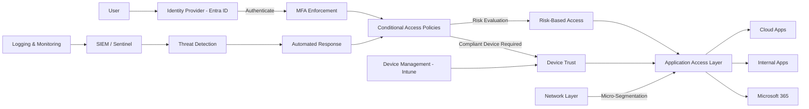

```mermaid
flowchart LR
    A[User] --> B[Identity Provider - Entra ID]

    B -->|Authenticate| C[MFA Enforcement]
    C --> D[Conditional Access Policies]

    D -->|Compliant Device Required| E[Device Trust]
    D -->|Risk Evaluation| F[Risk-Based Access]

    E --> G[Application Access Layer]
    F --> G

    G --> H[Microsoft 365]
    G --> I[Internal Apps]
    G --> J[Cloud Apps]

    K[Device Management - Intune] --> E

    L[Logging & Monitoring] --> M[SIEM / Sentinel]
    M --> N[Threat Detection]
    N --> O[Automated Response]

    O --> D

    P[Network Layer] -->|Micro-Segmentation| G
```
